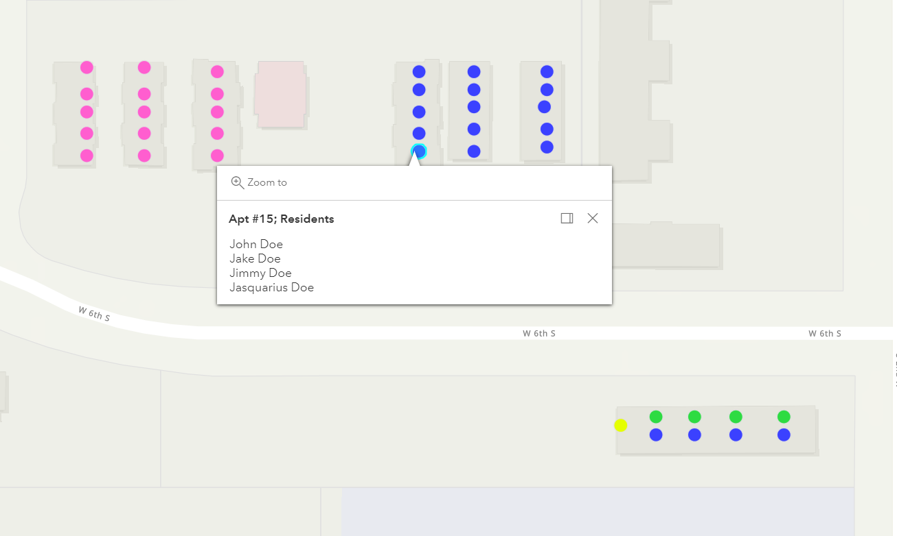

# Overview
This program displays a map that has color coded points with apartment numbers and the resident information. This is using the apartment information that my wife and I manage. The resident information is confidential and was not included. Users will need to customize a lot of the variable information themselves. 

Not yet implemented:
* CSV Reading
* Searchability
* Array Importation

# Development Environment
* Visual Studio Code  
* HTML5
* JavaScript 

# Execution
Once the files are imported, you need to fill in the declared array with the locations and numbers of your apartments. This would be the perfect place for a CSV read to a JS Array. After the locations and residences arrays are filled out, open the main file to display the webpage: `html main.html`

# Useful Websites

1. [JavaScript Reference](https://developer.mozilla.org/en-US/docs/Web/JavaScript/Reference)
2. [HTML Reference](https://www.w3schools.com/TAGS/default.ASP)
2. [GIS Mapping](https://www.esri.com/en-us/home)
